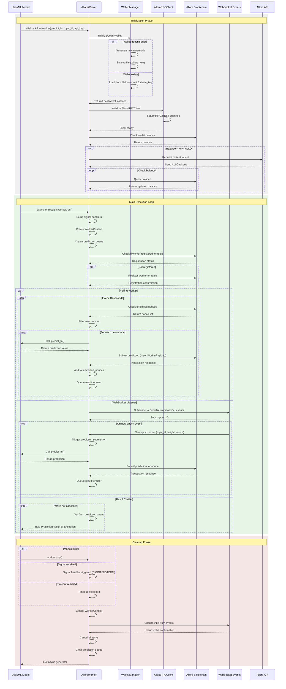

# Allora SDK Sequence Diagram

## Overview
The Allora SDK provides a Python interface for ML developers to submit predictions to the Allora Network. It handles WebSocket subscriptions, blockchain transactions, and automatic retries.

## Detailed Sequence Diagram

## Key Components

### 1. **AlloraWorker**
- Main entry point for ML developers
- Manages the lifecycle of prediction submissions
- Handles both polling and event-driven submission strategies

### 2. **WorkerContext**
- Go-like context pattern for coordinating shutdown
- Manages cancellation across all async tasks
- Ensures graceful cleanup of resources

### 3. **Wallet Management**
- Automatic wallet creation/loading
- Support for mnemonic, private key, or file-based storage
- Automatic faucet requests for testnet

### 4. **AlloraRPCClient**
- Wraps cosmpy's LedgerClient
- Provides Allora-specific blockchain operations
- Supports both gRPC and REST protocols

### 5. **Prediction Submission Flow**
- **Polling Mode**: Checks for unfulfilled nonces every 10 seconds
- **Event Mode**: Responds to WebSocket events for new epochs
- **Deduplication**: Tracks submitted nonces to avoid duplicates
- **Error Handling**: Queues exceptions for user handling

### 6. **Transaction Management**
- Configurable fee tiers (ECO, STANDARD, PRIORITY)
- Automatic retry logic for failed transactions
- Detailed error reporting with transaction hashes

## Data Flow

1. **Input**: User provides ML prediction function
2. **Processing**: Worker manages timing and submission
3. **Output**: Async iterator yields results/errors

## Error Handling

- Network errors are caught and yielded as exceptions
- Worker not whitelisted errors trigger graceful shutdown
- Transaction failures are logged with error codes
- Duplicate submissions are automatically filtered

## Environment Detection

The SDK automatically detects and adapts to:
- Shell environments (with signal handling)
- Jupyter notebooks
- Google Colab

## Resource Management

- WebSocket subscriptions are properly closed
- All async tasks are cancelled on shutdown
- Memory-efficient nonce tracking with automatic pruning
- Queue-based result delivery prevents memory leaks
